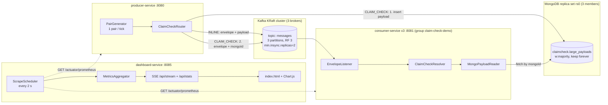

# Kafka Message Persistence to MongoDB — Claim-Check Pattern Demo

A Dockerized benchmark that answers one question: **for large (~2 MB) messages, is it
faster to push the payload through Kafka inline, or to park it in MongoDB and send
only a claim check?** The system runs both paths side by side under identical load
and streams a live latency comparison to a browser dashboard.

## The Claim-Check Pattern

Kafka is happiest with small messages; brokers must replicate every byte. The
claim-check pattern offloads large payloads to external storage and sends only a
reference through the topic:

- **INLINE** — the full payload travels inside the Kafka message.
- **CLAIM_CHECK** — the producer writes the payload to MongoDB first, then sends a
  lightweight envelope carrying the Mongo `_id`; the consumer fetches the payload
  back from MongoDB on receipt.

The producer emits **forced-path pairs**: every tick it generates one payload and
sends it *twice* — once forced INLINE, once forced CLAIM_CHECK — sharing a `pairId`.
The two paths therefore see the same payloads, the same brokers, and the same
consumers, making the latency comparison apples-to-apples. (A routing threshold of
2 MiB, `app.claim-check.threshold-bytes`, governs the non-forced case.)

## Architecture



Three Spring Boot 3.x / Java 21 services over clustered infrastructure, all defined
in [docker-compose.yml](docker-compose.yml):

| Service | Instances | Port | Role |
|---|---|---|---|
| `producer-service` | 1 | 8080 | Generates forced-path pairs, routes via threshold, inserts claim-check payloads into Mongo, publishes envelopes to Kafka |
| `consumer-service` | 3 | 8081 (internal) | Kafka listener group; resolves envelopes (fetching claim-check payloads from Mongo), records end-to-end latency |
| `dashboard-service` | 1 | **8085 (host-mapped)** | Scrapes every instance's Prometheus endpoint, aggregates, streams the comparison UI over SSE |
| `kafka1..3` | 3 | 9092 | Apache Kafka 3.9 KRaft quorum (no ZooKeeper); `message.max.bytes=3 MiB` |
| `mongo1..3` | 3 | 27017 | Mongo 7 replica set `rs0` |
| `topic-init` / `mongo-init` | one-shot | — | Create the `messages` topic; `rs.initiate` the replica set |

### Message envelope

Every Kafka message is a JSON `MessageEnvelope`:

```json
{
  "messageId": "…", "pairId": "…",
  "createdAt": "2026-07-16T…", "producedAtEpochNanos": 123,
  "payloadSizeBytes": 2097152, "forcedPath": "CLAIM_CHECK",
  "payload": null, "mongoId": "665f…"
}
```

Exactly one of `payload` (INLINE) or `mongoId` (CLAIM_CHECK) is set. The consumer
computes end-to-end latency from `producedAtEpochNanos`. A claim-check envelope
whose Mongo document is missing is logged as an error and skipped — never thrown,
so one bad message cannot stall the partition.

### Metrics

All instrumentation is Micrometer with percentile histograms, exposed at
`/actuator/prometheus` on every instance. Every metric is tagged
`path=INLINE|CLAIM_CHECK`:

| Metric | Type | Meaning |
|---|---|---|
| `producer.mongo.insert` | timer | Claim-check payload insert into Mongo |
| `producer.kafka.send` | timer | Kafka publish (acks=all) |
| `producer.messages` / `producer.bytes` | counters | Send throughput |
| `consumer.mongo.fetch` | timer | Claim-check payload fetch from Mongo |
| `consumer.processing` | timer | Deserialize-to-resolved processing time |
| `consumer.e2e.latency` | timer | Produce-to-consume end-to-end latency |
| `consumer.messages` / `consumer.bytes` | counters | Consume throughput |

## The Visual Dashboard

No Prometheus server, no Grafana — the dashboard is a self-contained Spring Boot
app serving a single static page (vanilla JS + vendored Chart.js, no CDN). It
scrapes each instance every 2 seconds, aggregates across the three consumers, and
pushes snapshots to the browser via Server-Sent Events. Open
**http://localhost:8085** and read top to bottom:

1. **Header bar** — title, current load settings (payload size, pairs/s, window),
   live indicator, pause button.
2. **Hero comparison strip** — INLINE and CLAIM_CHECK face each other: e2e **p95 as
   the headline number**, msg/s + MB/s sublines, a latency sparkline per path, and
   centered between them an **overhead delta badge** (+ms and +% p95 of claim-check
   relative to inline) — the single number the whole demo exists to produce.
3. **Latency percentiles chart** — rolling 5-minute line chart per path: p50 solid,
   p99 dashed (the tail is where the two paths diverge).
4. **"Where the time goes"** — horizontal segment bars per path, width proportional
   to total average latency: inline = kafka-send + processing; claim-check =
   mongo-insert + kafka-send + mongo-fetch + processing. Alongside: a Mongo storage
   counter (total documents, GB) — relevant because retention is keep-forever.
5. **Cluster status strip** — brokers up (n/3), Mongo replica-set state and primary,
   producer rate, and each consumer's partition/rate/lag with a warning icon when
   lagging. Click to expand per-instance detail tiles.

`GET /api/stats` returns the same aggregated comparison model as JSON for scripting.

## Running It

Prerequisites: Docker with ~4 GB free memory and disk headroom (see storage note).

```bash
docker compose build
docker compose up -d
docker compose ps          # wait until all services report healthy
open http://localhost:8085 # the dashboard
curl -s localhost:8085/api/stats | jq .   # scripted access
```

### Tuning the load

Producer properties (settable via compose `environment` or `application.yml`):

| Property | Default | Effect |
|---|---|---|
| `app.load.enabled` (`LOAD_ENABLED`) | `true` | Toggle the pair generator |
| `app.load.tick-millis` | `200` | One pair per tick → 5 pairs/s |
| `app.load.payload-bytes` | `2097152` | Payload size (2 MiB) |
| `app.claim-check.threshold-bytes` | `2097152` | Routing threshold for non-forced messages |

> **Storage growth warning:** retention is keep-forever (no TTL, supports replay).
> At defaults, ~2 MB x 5 pairs/s is roughly **600 MB/min of MongoDB growth**. For
> long runs, lower the rate or payload size, or prune `claimcheck.large_payloads`.

### Failover recipe

Both clusters tolerate one node down (`min.insync.replicas=2`, replica set majority):

```bash
docker compose stop kafka2 mongo2    # flow continues; dashboard status strip degrades
docker compose start kafka2 mongo2   # recovery is automatic
```

## Project Layout

```
├── docker-compose.yml        # 3x kafka, 3x mongo, init jobs, producer, 3x consumer, dashboard
├── producer-service/         # envelope model, router, Mongo store, Kafka publisher, pair generator
├── consumer-service/         # listener, claim-check resolver, Mongo reader, metrics
├── dashboard-service/        # Prometheus scraper, aggregator, SSE stream, static UI
├── specs/                    # design spec + per-file LLM generation specs (specs/gen/)
├── tools/                    # local-LLM codegen loop (llm-gen.sh, llm-loop.py, token-report.py)
└── docs/plans/               # implementation plan with task checkboxes + session handoff notes
```

## Development Workflow

This repo is built with a **local-LLM codegen loop**: the orchestrating agent writes
per-file generation specs (`specs/gen/*.md`), a local model generates each file
(`tools/llm-gen.sh` single-shot for tests, `tools/llm-loop.py`
generate→test→self-fix for implementations), and the agent reviews and commits.
Strict TDD: tests are generated first and confirmed RED before any implementation
exists. See [docs/plans/2026-07-15-claim-check-implementation.md](docs/plans/2026-07-15-claim-check-implementation.md).

### Testing

Each service has its own Gradle wrapper:

```bash
(cd producer-service && ./gradlew test)   # unit + Testcontainers integration (real Kafka + Mongo)
(cd consumer-service && ./gradlew test)
(cd dashboard-service && ./gradlew test)
```

Integration tests use Testcontainers (`apache/kafka:3.9.1`, `mongo:7`) — Docker must
be running.

## Status

| Component | State |
|---|---|
| Infrastructure (compose topology, clusters, init jobs) | Done |
| Producer service (router, Mongo store, publisher, pair generator, metrics) | Done, tests green |
| Consumer service (listener, resolver, Mongo reader, metrics) | Done, tests green |
| Dashboard service (scraper, aggregator, SSE, UI) | In progress — design final (above), implementation is Tasks 6–7 of the plan |
| End-to-end compose validation | Pending (Task 8) |
