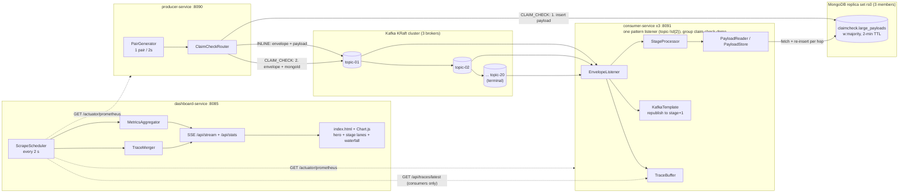

# Kafka Message Persistence to MongoDB — Claim-Check Relay-Chain Benchmark

A Dockerized benchmark that answers one question: **for large (~2 MB) messages
traversing a long pipeline, is it faster to carry the payload through Kafka inline
at every hop, or to park it in MongoDB and pass only a claim check?** A message
enters at `topic-01` and relays through a configurable chain of topics
(`topic-02` … `topic-20` by default) before terminating; both paths run the same
chain under identical conditions and stream a live latency comparison — chain-total
and per-hop — to a browser dashboard. This is explicitly a **latency measurement,
not a load test**: the default publish rate is deliberately low (0.5 pairs/s) so the
system is loaded but never saturated.

## The Claim-Check Pattern

Kafka is happiest with small messages; brokers must replicate every byte. The
claim-check pattern offloads large payloads to external storage and sends only a
reference through the topic:

- **INLINE** — the full payload travels inside the Kafka message.
- **CLAIM_CHECK** — the producer writes the payload to MongoDB first, then sends a
  lightweight envelope carrying the Mongo `_id`; the consumer fetches the payload
  back from MongoDB on receipt.

The producer emits **forced-path pairs**: every tick it generates one payload and
sends it *twice* — once forced INLINE, once forced CLAIM_CHECK — sharing a `pairId`,
both entering the chain at `topic-01`. The two paths therefore see the same
payloads, the same brokers, and the same consumers at every hop, making the
latency comparison apples-to-apples. (A routing threshold of 2 MiB,
`app.claim-check.threshold-bytes`, governs the non-forced case.)

### The relay chain (worst case, every hop does real work)

At each non-terminal stage `N` (`1 <= N < chain.length`):

- **INLINE** — deserialize, apply a small deterministic same-size transform,
  republish the (still inline) payload to `topic-N+1`.
- **CLAIM_CHECK** — fetch the current document from Mongo, apply the identical
  transform, **insert a brand-new document**, and republish an envelope carrying
  the *new* `mongoId` to `topic-N+1`. This is deliberately the worst case for
  claim-check (a real pipeline stage that must read and re-persist the payload),
  not a cheap reference pass-through.

The terminal stage (`N >= chain.length`, so a stage number surviving past a
shrunk `chain.length` from a previous run is still terminal) does none of that —
no transform, no Mongo I/O — and instead computes **chain-total latency** from
the untouched origin timestamp carried in the envelope since `topic-01`.

## Architecture



Three Spring Boot 3.x / Java 21 services over clustered infrastructure, all defined
in [docker-compose.yml](docker-compose.yml):

| Service | Instances | Port | Role |
|---|---|---|---|
| `producer-service` | 1 | 8090 | Generates forced-path pairs, routes via threshold, inserts claim-check payloads into Mongo, publishes envelopes to `topic-01` |
| `consumer-service` | 3 | 8091 (internal) | One topic-pattern listener group spanning all `topic-NN`; each message's stage is derived from the topic it arrived on; runs `StageProcessor`, republishes to the next stage or records chain-total at the terminal stage; also serves `/api/traces/latest` |
| `dashboard-service` | 1 | **8085 (host-mapped)** | Scrapes every instance's Prometheus endpoint plus each consumer's trace endpoint, aggregates, streams the comparison UI over SSE |
| `kafka1..3` | 3 | 9092 | Apache Kafka 3.9 KRaft quorum (no ZooKeeper); `message.max.bytes=3 MiB` |
| `mongo1..3` | 3 | 27017 | Mongo 7 replica set `rs0` |
| `topic-init` / `mongo-init` | one-shot | — | Create `topic-01..topic-{chain.length}`; `rs.initiate` the replica set and set the payload TTL |

### Message envelope

Every Kafka message is a JSON `MessageEnvelope`:

```json
{
  "messageId": "…", "pairId": "…",
  "createdAt": "2026-07-16T…", "producedAtEpochNanos": 123,
  "payloadSizeBytes": 2097152, "forcedPath": "CLAIM_CHECK",
  "payload": null, "mongoId": "665f…",
  "hopTrace": [{"stage": 1, "consumedAtEpochNanos": 124, "publishedAtEpochNanos": 125}]
}
```

Exactly one of `payload` (INLINE) or `mongoId` (CLAIM_CHECK) is set.
`producedAtEpochNanos` is the untouched origin timestamp, carried through every
hop, from which the terminal stage computes chain-total latency. `hopTrace` is an
append-only list of per-hop timestamps (never mutated — each hop builds a whole
new `MessageEnvelope`); the terminal hop's `publishedAtEpochNanos` is `null`
since there's no next stage to receive it. A claim-check envelope whose Mongo
document is missing is logged as an error and skipped — never thrown, so one bad
message cannot stall the partition (this can happen if the 2-minute TTL reaps a
document while a stage is stalled by a rebalance; watch `stage.skipped` if that
happens mid-run, since it biases the affected run's percentiles).

### Metrics

All instrumentation is Micrometer, exposed at `/actuator/prometheus` on every
instance. Every metric is tagged `path=INLINE|CLAIM_CHECK`; hop-level metrics also
carry `stage=<n>`:

| Metric | Type | Meaning |
|---|---|---|
| `producer.mongo.insert` | timer | Entry-stage claim-check payload insert into Mongo |
| `producer.kafka.send` | timer | Kafka publish (acks=all) |
| `producer.messages` / `producer.bytes` | counters | Send throughput |
| `consumer.mongo.fetch` | timer | Claim-check payload fetch from Mongo (any hop) |
| `chain.e2e.latency` | timer, **percentiles** | Chain-total latency, terminal stage only — the headline number |
| `stage.hop.latency` | timer, tagged `stage`, count/sum only | Per-hop latency (consume → send-ack or terminal record) |
| `consumer.messages` / `consumer.bytes` | counters | Per-hop throughput |

Only `chain.e2e.latency` publishes percentiles; per-stage timers are deliberately
count/sum-only (averages) to avoid a per-stage-per-path histogram cardinality
blowup across up to 20 stages.

## The Visual Dashboard

No Prometheus server, no Grafana — the dashboard is a self-contained Spring Boot
app serving a single static page (vanilla JS + vendored Chart.js, no CDN). It
scrapes each instance every 2 seconds, aggregates across the three consumers, and
pushes snapshots to the browser via Server-Sent Events. Open
**http://localhost:8085** and read top to bottom:

1. **Header bar** — title, current load settings, live indicator, pause button.
2. **Hero comparison strip** — INLINE and CLAIM_CHECK face each other: **chain-total
   e2e p95 as the headline number** (entry at `topic-01` to the terminal stage),
   msg/s + MB/s sublines, a latency sparkline per path, and centered between them
   an **overhead delta badge** (+ms and +% p95 of claim-check relative to inline).
3. **Latency percentiles chart** — rolling 5-minute line chart of chain-total
   latency per path: p50 solid, p99 dashed.
4. **"Where the time goes"** — horizontal segment bars per path (per-hop averages):
   inline = kafka-send; claim-check = mongo-insert + kafka-send + mongo-fetch.
   Alongside: a Mongo storage counter (total documents, GB) — bounded now by the
   2-minute TTL rather than keep-forever.
5. **Stage lanes** — two rows (INLINE/CLAIM_CHECK), one cell per stage, opacity
   scaled by that stage's average hop latency (`stage.hop.latency`) — the live,
   always-on picture of where latency accumulates along the chain.
6. **Latest pair, hop by hop** — a sampled waterfall of one matched INLINE/
   CLAIM_CHECK pair's actual journey through the chain, built from the envelope's
   `hopTrace` and fetched from whichever consumer replica terminated it (matched
   across replicas by `pairId` when both twins are available, per `TraceMerger`).
7. **Cluster status strip** — brokers up (n/3), Mongo replica-set state and primary,
   producer rate, and each consumer's partition/rate/lag with a warning icon when
   lagging. Click to expand per-instance detail tiles.

`GET /api/stats` returns the same aggregated comparison model as JSON for scripting.

## Running It

Prerequisites: Docker with ~4 GB free memory and disk headroom (see storage note).

```bash
docker compose build
docker compose up -d
docker compose ps          # wait until all services report healthy
open http://localhost:8085 # the dashboard
curl -s localhost:8085/api/stats | jq .   # scripted access
```

### Tuning the load and chain length

Producer/consumer properties (settable via compose `environment` or `application.yml`):

| Property (env var) | Default | Effect |
|---|---|---|
| `app.load.enabled` (`LOAD_ENABLED`) | `true` | Toggle the pair generator |
| `app.load.tick-millis` (`LOAD_TICK_MILLIS`) | `2000` | One pair per tick → **0.5 pairs/s** |
| `app.load.payload-bytes` | `2097152` | Payload size (2 MiB), constant across every hop on both paths |
| `app.claim-check.threshold-bytes` | `2097152` | Routing threshold for non-forced messages |
| `app.chain.length` (`CHAIN_LENGTH`) | `20` | Number of relay-chain topics/stages; `topic-init` creates exactly this many |

> **This is a latency measurement, not a load test.** 0.5 pairs/s keeps the system
> loaded but comfortably under saturation, isolating transport/persistence cost
> from queueing delay. Ratchet `LOAD_TICK_MILLIS` down (or `CHAIN_LENGTH` up) as a
> **separate experiment** to find the saturation point — don't conflate the two.
> Rough arithmetic: at rate *R* pairs/s, chain length *L*, payload size *S* bytes,
> inline Kafka traffic alone is roughly `2 * R * L * S` bytes/s before RF
> multiplication (both twins, every hop) — at the 5 pairs/s single-hop default this
> was already ~20 MB/s; at 20 hops it would be ~400 MB/s, which is why the default
> dropped to 0.5 pairs/s for the chain.

> **Storage:** the claim-check payload collection uses a 2-minute TTL (not
> keep-forever) — every non-terminal claim-check hop inserts a *new* document, so
> a 20-hop chain means up to 19 new documents per claim-check message; without a
> short TTL this would grow unbounded fast. If a stage stalls (broker hiccup,
> consumer rebalance) longer than the TTL, the document it needs can expire —
> watch the `stage.skipped` counter; a non-zero skip rate during a run invalidates
> that run's percentiles (survivorship bias, not a bug).

### Failover recipe

Both clusters tolerate one node down (`min.insync.replicas=2`, replica set majority):

```bash
docker compose stop kafka2 mongo2    # flow continues; dashboard status strip degrades
docker compose start kafka2 mongo2   # recovery is automatic
```

### Scalability validation (manual)

Not automated — run these by hand and watch the dashboard:

1. **Increasing load:** lower `LOAD_TICK_MILLIS` in steps (e.g. 2000 → 1000 → 500)
   and watch chain-total p95/p99 and `stage.hop.latency` per stage for where the
   curve stops being flat — that's the saturation point for this chain length.
2. **Increasing chain length:** raise `CHAIN_LENGTH` (`docker compose up -d` after
   changing the env var; `topic-init` re-runs and creates the additional topics)
   and compare chain-total latency at 1, 5, and 20 hops to see how per-hop cost
   compounds differently for INLINE (payload re-transferred every hop) vs
   CLAIM_CHECK (small envelope every hop, cost concentrated in Mongo I/O).
3. **Mid-run node loss:** with a run in progress, `docker compose stop kafka2` (or
   `mongo2`) and confirm the chain keeps flowing — check `stage.skipped` stays at
   zero (or note any nonzero window as excluded from that run's percentiles), then
   `docker compose start kafka2` and confirm recovery.

## Project Layout

```
├── docker-compose.yml        # 3x kafka, 3x mongo, init jobs, producer, 3x consumer, dashboard
├── producer-service/         # envelope model, router, Mongo store, Kafka publisher, pair generator
├── consumer-service/         # listener, claim-check resolver, Mongo reader, metrics
├── dashboard-service/        # Prometheus scraper, aggregator, SSE stream, static UI
├── specs/                    # design specs (rev 2 single-hop + relay-chain), implementation plan, per-file LLM generation specs (specs/gen/)
├── tools/                    # local-LLM codegen loop (llm-gen.sh, llm-loop.py, token-report.py)
└── docs/plans/               # earlier implementation plan with task checkboxes + session handoff notes
```

## Development Workflow

This repo is built with a **local-LLM codegen loop**: the orchestrating agent writes
per-file generation specs (`specs/gen/*.md`), a local model generates each file
(`tools/llm-gen.sh` single-shot for tests, `tools/llm-loop.py`
generate→test→self-fix for implementations), and the agent reviews and commits.
Strict TDD: tests are generated first and confirmed RED before any implementation
exists. See [docs/plans/2026-07-15-claim-check-implementation.md](docs/plans/2026-07-15-claim-check-implementation.md).

### Testing

Each service has its own Gradle wrapper:

```bash
(cd producer-service && ./gradlew test)   # unit + Testcontainers integration (real Kafka + Mongo)
(cd consumer-service && ./gradlew test)
(cd dashboard-service && ./gradlew test)
```

Integration tests use Testcontainers (`apache/kafka:3.9.1`, `mongo:7`) — Docker must
be running.

## Status

| Component | State |
|---|---|
| Infrastructure (20-topic relay chain, clusters, init jobs, 2-min TTL) | Done |
| Producer service (entry point at topic-01, router, Mongo store, pair generator, metrics) | Done, tests green |
| Consumer service (topic-pattern listener, StageProcessor, PayloadStore, chain/hop metrics, trace endpoint) | Done, tests green |
| Dashboard service (scraper, chain-total/hop aggregator, cross-replica trace merge, SSE, UI) | Done, tests green — browser-verified (empty-state render, no console errors) |
| End-to-end compose validation against the full 20-hop chain | Not yet re-run since the relay-chain rework — recommended next step |
